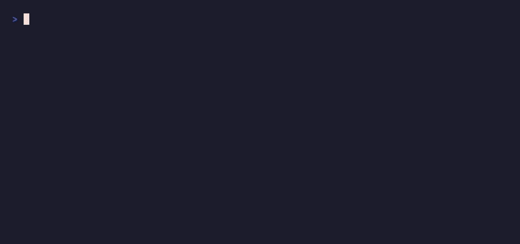
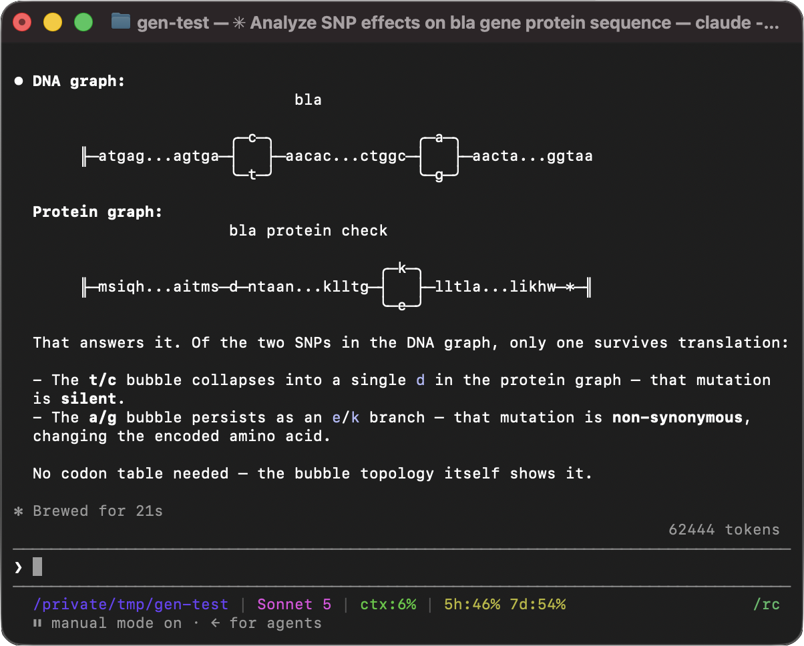
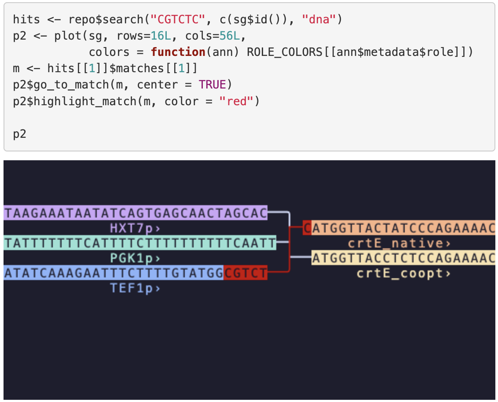

# Gen

Gen brings version control to genetic sequences. With it, you can track variants and edits to genes or whole genomes, across multiple generations and lineages. You can clone genome repositories, create branches, make edits, and push changes to a shared remote using the same workflow developers know from Git. It works across FASTA files, VCFs, GenBank records, and other common bioinformatics formats. Under the hood, Gen stores data as a sequence graph, allowing a single repository to represent a reference genome, known variants, and engineered modifications without repeatedly storing the same sequence.

[](https://pypi.org/project/gen/) [](LICENSE)



## Install

**Gen client**: prebuilt binaries for macOS and Linux are on the [releases page](https://github.com/genhub-bio/gen/releases): [macOS (.pkg)](https://github.com/genhub-bio/gen/releases/download/nightly/gen.macos.pkg), [Linux x86_64 (.zip)](https://github.com/genhub-bio/gen/releases/download/nightly/gen.linux-x86_64.zip), [Linux arm64 (.zip)](https://github.com/genhub-bio/gen/releases/download/nightly/gen.linux-arm64.zip). Gen is built primarily for Unix-like systems; on Windows, you can install [WSL](https://learn.microsoft.com/en-us/windows/wsl/) to get a Linux environment, then use the Linux binary above from inside it.

**Python package**: install on macOS, Linux, or Windows using:

```sh
pip install gen
```

Install the `jupyter` extra to include an interactive graph widget for Jupyter and other anywidget-compatible notebooks:

```sh
pip install gen[jupyter]
```

**R package**: install on macOS (Apple silicon) using the `remotes` package:

```r
install.packages("remotes")
remotes::install_url(
  "https://github.com/genhub-bio/gen/releases/download/v0.2.0/genr_0.2.0-macos-arm64.tgz"
)
```

Windows builds are published as `genr-windows-<version>.zip` on the same [releases page](https://github.com/genhub-bio/gen/releases).

## Quick start

### Set up a repository

```sh
gen init
gen import fasta reference.fa --reference hg38
```

### Branch, update, and inspect

```sh
# Branch before making changes
gen checkout --branch experiment/na12878

# Apply variants from a VCF — Gen adds new edges to the graph without touching existing nodes
gen update vcf variants.vcf --reference hg38 --sample NA12878

# Review the operation log
gen operations

# Browse the graph in the terminal
gen view
```

### Push to a remote

In order to upload data to a remote repository, you have to add a remote repository (call it `origin` here), log in to authenticate and optionally make it the default remote for this repository, and then run the push command:

```sh
gen remote add origin https://www.genhub.bio/api/repos/<user>/<repo>
gen remote login origin
gen remote set-default origin
gen push
```

Subsequent pushes from this repository only need `gen push`.

### Python and R bindings

The Python package lets you import, edit, and export sequence graphs from Python. The R package covers the same workflows and interoperates with Bioconductor types such as DNAStringSet and GRanges. The `jupyter` extra adds an interactive widget for graph visualization and exploration. Remote operations (`push` and `pull`) require the client for now.

Example Python code to initialize or load a repository, import a sequence as reference, applying variants from a
VCF file, and viewing the resulting sequence graph:

```python
import gen

repo = gen.Repository(".")
repo.import_reference_fasta("reference.fa", "hg38")
sample = repo.update_with_vcf("variants.vcf", reference="hg38", sample="NA12878")[0]
sample.plot()
```

Equivalent R code:
```r
library(genr)

repo <- Repository(".")
repo$import_reference_fasta("reference.fa", reference = "hg38")
sample <- repo$update_with_vcf(filename = "variants.vcf", sample = "NA12878", reference = "hg38")[[1]]
plot(sample)
```

## Features

- Every import, update, and merge is a recorded operation. You can roll back to any prior state with `gen checkout`, compare two branches with `gen view-diff`, or share a set of changes as a patch file.
- Gen can import from FASTA, GenBank, GFA, VCF, GAF, and combinatorial part libraries, and export to FASTA, GenBank, or GFA for downstream tools like `vg` or Bandage.
- Sequence search works across all paths in a graph, including IUPAC ambiguity codes, via `gen search` or `repo.search()` in Python and R.
- GFF3 annotation tracks are visible in both the terminal viewer and the interactive widget.
- For combinatorial library design, you define a parts list and a slot table; Gen builds the graph of all combinations without enumerating the sequences explicitly.
- `gen clone`, `gen push`, and `gen pull` work against GenHub. Any public repository is clonable with a single URL.
- The R package includes direct import from Bioconductor `DNAStringSet` and `GRanges` objects.

## Designed for AI agents

Agents can interact with Gen through the command line or the Python API, which was designed with AI agents in mind. Nearly every user action has a programmatic equivalent, with methods returning samples and sequence graphs as Python objects that can be passed directly into subsequent operations. Graph visualizations in Python notebooks include embedded text representations that LLMs can interpret directly. Because every operation is recorded in the repository, agents can inspect history, compare revisions, and recover from failures.

## Screenshots

<table>
  <tr>
    <td width="50%" valign="top" align="center">
      <br>
      <sub><b>Python</b>: Claude reasons about a DNA graph and its protein translation, concluding that one of two SNPs is silent.</sub>
    </td>
    <td width="50%" valign="top" align="center">
      <br>
      <sub><b>R</b>: finding a restriction site that stradles the junction between parts, from <a href="gen-r/vignettes/yeast_expression_library.Rmd"><code>yeast_expression_library.Rmd</code></a>.</sub>
    </td>
  </tr>
</table>

## Example workflows

- [Model a yeast cross](examples/yeast_crosses/Analysis.md): cross two beer-yeast strains from the 1002 Yeast Genomes collection, building the combined graph from either VCF variant calls or whole-genome alignment.
- [Explore a brewing-yeast variant graph in Python](gen-python/examples/flo11_brq_demo.ipynb): analyse the *FLO11* locus on a 9.1 kb *S. cerevisiae* chrIX fragment, searching and navigating the variant graph in the interactive widget.
- [Screen a combinatorial library in R](https://genhub-bio.github.io/gen/vignettes/yeast_expression_library.html): build a combinatorial YTK expression-cassette library, easily detecting a restriction site that appears only at one part junction, not in any individual part.

## Data model

Gen represents sequences as a sequence graph: nodes hold sequence fragments, edges connect them, and any linear sequence is reconstructed by walking a defined path. New variants extend the graph without splitting existing nodes, so node IDs remain stable across updates. This differs from the segment graph model used by tools like vg, where the reference sequence is split into pieces to accommodate each variant; Gen converts between the two formats on GFA export. See [docs/coordinates.md](docs/coordinates.md) for a full explanation with diagrams.

## Documentation

Full command reference, Python and R API docs, and tutorials are at [genhub.bio/docs](https://www.genhub.bio/docs).

## Building from source

Requires a Rust toolchain ([rustup](https://rustup.rs/)).

```sh
git clone https://github.com/genhub-bio/gen.git
cd gen
cargo build --release
# binary at ./target/release/gen
```

For Python and R bindings, see [gen-python/README.md](gen-python/README.md) and [gen-r/README.md](gen-r/README.md).
