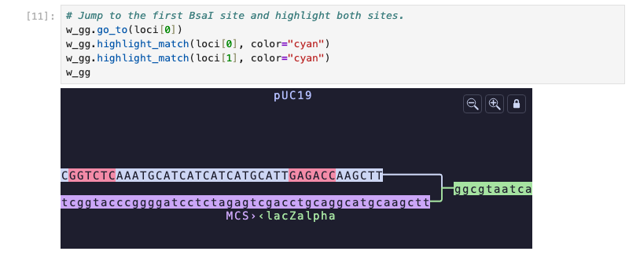
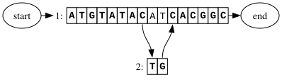
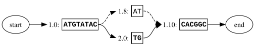

# Gen

Gen brings version control to genetic sequences. You can clone repositories, create branches, make edits, and push changes to a shared remote using the same workflow developers know from Git. It works across FASTA files, VCFs, GenBank records, and other common bioinformatics formats. Under the hood, Gen stores data as a sequence graph, allowing a single repository to represent a reference genome, known variants, and engineered modifications without repeatedly storing the same sequence.

[](https://pypi.org/project/gen/) [](LICENSE)


## Install

**CLI binary** — prebuilt binaries for macOS and Linux are on the [releases page](https://github.com/genhub-bio/gen/releases): [macOS (.pkg)](https://github.com/genhub-bio/gen/releases/download/nightly/gen.macos.pkg), [Linux x86_64 (.zip)](https://github.com/genhub-bio/gen/releases/download/nightly/gen.linux-x86_64.zip), [Linux arm64 (.zip)](https://github.com/genhub-bio/gen/releases/download/nightly/gen.linux-arm64.zip). Gen is built for Unix-like systems; on Windows, install [WSL](https://learn.microsoft.com/en-us/windows/wsl/) to get a Linux environment, then use the Linux binary above from inside it.

**Python**

```sh
pip install gen
```

For the interactive graph widget in Jupyter and other anywidget-compatible notebooks, install the `jupyter` extra:

```sh
pip install gen[jupyter]
```

**R** — see the [installation guide](https://www.genhub.bio/docs/installation) for platform-specific instructions.

<!--
TODO: restore once the R publish workflow ships genr binaries to a release (see publish-r-packages-tag.yaml).
On macOS (Apple silicon):

```r
install.packages("remotes")
remotes::install_url(
  "https://github.com/genhub-bio/gen/releases/download/v0.1.31/genr_0.1.31-macos-arm64.tgz"
)
```

Windows builds are published as `genr-windows-<version>.zip` on the same [releases page](https://github.com/genhub-bio/gen/releases).
-->


## Quick start

### Set up a repository

```sh
gen init
gen import fasta reference.fa --reference hg38
```

### Branch, update, and inspect

```sh
# Branch before making changes
gen branch --create experiment/na12878
gen checkout --branch experiment/na12878

# Apply variants from a VCF — Gen adds new edges to the graph without touching existing nodes
gen update vcf variants.vcf --reference hg38 --sample NA12878

# Review the operation log
gen operations

# Browse the graph in the terminal
gen view
```

### Push to a remote

Pushing needs a remote repository to push to and an authenticated session, so add the remote, log in, and set it as the default before the first push:

```sh
gen remote add origin https://www.genhub.bio/api/repos/<user>/<repo>
gen remote login origin
gen remote set-default origin
gen push
```

Subsequent pushes from this repository only need `gen push`.

### Python and R bindings

Python and R libraries expose the same operations. The R bindings are compatible with Bioconductor types such as DNAStringSet and GRanges. The Python API exposes samples and sequence graphs as rich objects that provide a programmatic equivalent for every action available through the CLI. The `jupyter` extra provides an interactive widget for graph visualization and exploration. The Python module was built with AI agents in mind, for example by embedding a textual representation of graph visualizations in notebook files alongside the pixel data. 

```python
import gen

repo = gen.Repository(".")
repo.import_reference_fasta("reference.fa", "hg38")
sample = repo.update_with_vcf("variants.vcf", reference="hg38", sample="NA12878")[0]
sample.plot()
```

```r
library(genr)

repo <- Repository(".")
repo$import_reference_fasta("reference.fa", reference = "hg38")
sample <- repo$update_with_vcf(filename = "variants.vcf", sample = "NA12878", reference = "hg38")[[1]]
plot(sample)
```

## Features

- Every import, update, and merge is a recorded operation. You can roll back to any prior state with `gen checkout`, compare two branches with `gen view-diff`, or share a set of changes as a patch file.
- Gen can import from FASTA, GenBank, GFA, VCF, GAF, and combinatorial part libraries, and export to FASTA, GenBank, or GFA for downstream tools like `vg` or Bandage.
- Sequence search works across all paths in a graph, including IUPAC ambiguity codes, via `gen search` or `repo.search()` in Python and R.
- GFF3 annotation tracks are visible in both the terminal viewer and the interactive widget.
- For combinatorial library design, you define a parts list and a slot table; Gen builds the graph of all combinations without enumerating the sequences explicitly.
- `gen clone`, `gen push`, and `gen pull` work against GenHub. Any public repository is clonable with a single URL.
- The R package includes direct import from Bioconductor `DNAStringSet` and `GRanges` objects.

## Screenshots

**Jupyter widget** — a combinatorial expression-cassette library built with `import_library()`, from [`introduction.ipynb`](gen-python/examples/introduction.ipynb)



**RStudio viewer** — a pUC19 sequence graph with GenBank annotation tracks, branching at an unexpected mutation found by [`introduction.Rmd`](gen-r/vignettes/introduction.Rmd)


## Example workflows

**Using the bindings**

- [Golden Gate redesign, in R](gen-r/vignettes/introduction.Rmd) — import an annotated pUC19 GenBank record, design a Golden Gate MCS swap, confirm the cut sites with `search()`, export for synthesis, then catch an unintended mutation by importing the sequencing VCF.
- [Screening a combinatorial library for junction-emergent cut sites, in R](gen-r/vignettes/yeast_expression_library.Rmd) — build a 12-construct promoter/CDS/terminator library for a yeast expression cassette, then use a single `search()` call to find a BsmBI site that only appears at one part junction, not in any individual part.
- [Genome editing in Python](examples/yeast_editing/edit-yeast-and-export-fasta.ipynb) — import a yeast chromosome, apply a cassette edit with `update_with_sequence()`, and export the result as FASTA.

**CLI only**

- [Combinatorial plasmid design](examples/combinatorial_plasmid_design/combinatorial_design.md) — insert a promoter/RBS library into pUC19 with `gen update --library`, export to GFA, then identify colony genotypes from long-read sequencing. No Python or R required.

## Data model

Gen represents sequences as a sequence graph. Nodes hold sequence fragments, edges connect them, and any linear sequence is reconstructed by walking a defined path. New variants extend the graph without splitting existing nodes, so node IDs remain stable across updates.



**_Figure 1_**: _Sequence graph representation of a variant where two nucleotides AT are replaced by TG; the modified sequence (shown in bold) is stored as a path over a list of edges that address specific coordinates._

This differs from the segment graph model used by tools like vg and Bandage, where the reference sequence is split into pieces to accommodate each variant. Gen converts between the two formats on GFA export.



**_Figure 2_**: _Segment graph model corresponding to the variant in Figure 1. The original sequence is split into 3 parts; the modified path is defined by a list of nodes that refer to these segments._

For a longer explanation see [docs/coordinates.md](docs/coordinates.md).

## Documentation

Full command reference, Python and R API docs, and tutorials are at [genhub.bio/docs](https://www.genhub.bio/docs).

## Building from source

Requires a Rust toolchain ([rustup](https://rustup.rs/)).

```sh
git clone https://github.com/genhub-bio/gen.git
cd gen
cargo build --release
# binary at ./target/release/gen
```

For Python and R bindings, see [gen-python/README.md](gen-python/README.md) and [gen-r/README.md](gen-r/README.md).
