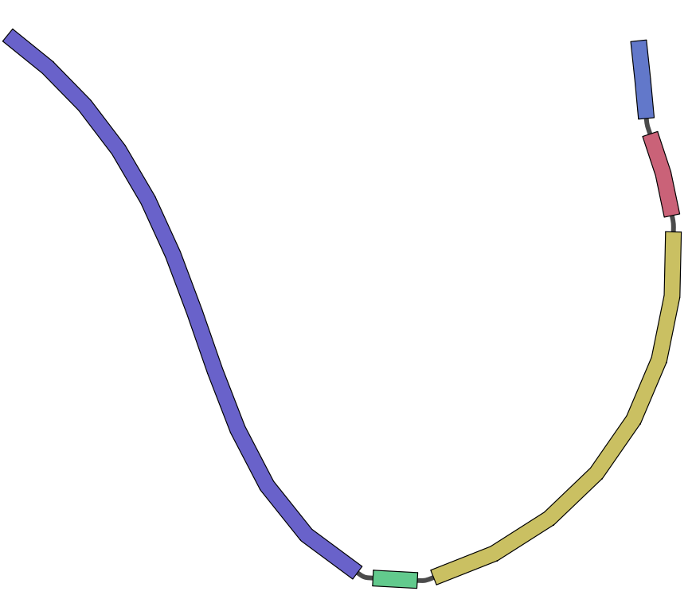
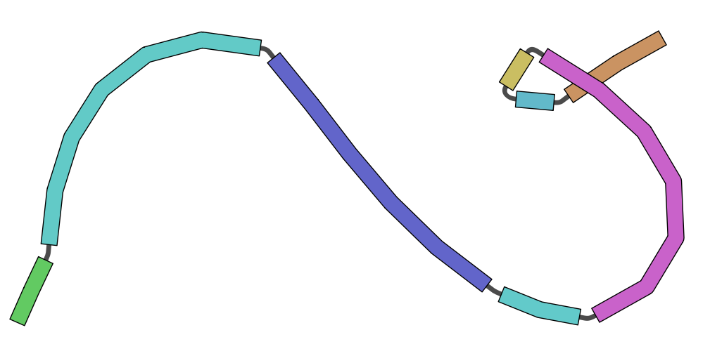

# Iterative Changes

A core capability of Gen is the ability to model iterative engineering to a cell line. This represents multiple rounds
of engineering. As an example, suppose we insert two landing pads into a genome for general use. Iterative engineering
allows us to work off the cell line assuming these changes are baked into.

The challenge in modeling iterative engineering is the frame of reference for changes. In the above example, inserting
a landing pad will change the reference coordinates of the resulting genome. Thus, if we are working with 2 landing pads,
we may want to be able to address them in either the reference frame of the initial reference genome, or in the reference
frame of the changed genome. To illustrate this, here is an example of 2 rounds of engineering from a base sequence.

From the repository root, initialize Gen and import the reference sequence. The VCF fixtures used below are in `fixtures/`.

```bash
gen init
gen import fasta fixtures/simple.fa --collection simple_example --reference reference
```

This creates a collection, `simple_example`, with the simple FASTA file serving as the reference genome in sample
`reference`. This could just
as easily be Hg38, etc.

Next, we use a vcf file to model changes. We want to delete two regions of the genome:

```text
##fileformat=VCFv4.1
##filedate=Tue Sep  4 13:12:57 2018
##reference=simple.fa
##contig=<ID=m123,length=34>
##phasing=none
##FORMAT=<ID=GT,Number=1,Type=String,Description="Genotype">
#CHROM	POS	ID	REF	ALT	QUAL	FILTER	INFO	FORMAT	f1
m123	3	.	CGA	C	1611.92	.		GT	1
m123	16	.	GAT	G	1611.92	.		GT	1
```

```bash
gen update vcf fixtures/simple_iterative_engineering_1.vcf --parent-samples reference
```
This creates a new sample, `f1`, with the above changes baked into its genome. Its parent is explicitly set to
`reference`, so VCF coordinates use the reference genome's frame. This example is a haploid such as e. coli
where the genotype is always homozygous. Graphically, the genome now appears as such:



Next, we want to make more changes -- snps, insertions, and deletions based on this changed genome.

```vcf
##fileformat=VCFv4.1
##filedate=Tue Sep  4 13:12:57 2018
##reference=simple.fa
##contig=<ID=m123,length=34>
##phasing=none
##FORMAT=<ID=GT,Number=1,Type=String,Description="Genotype">
#CHROM	POS	ID	REF	ALT	QUAL	FILTER	INFO	FORMAT	f2
m123	5	.	C	G	1611.92	.		GT	1
m123	17	.	G	GAATCA	1611.92	.		GT	1
m123	27	.	GA	G	1611.92	.		GT	1
```

```bash
gen update vcf fixtures/simple_iterative_engineering_2.vcf --parent-samples f1
```

This command specifies sample `f1` as the parent, so its coordinate frame is used for the changes. The VCF sample name
creates sample `f2`. For each new VCF sample, pass `--parent-samples` to select its coordinate frame. The resulting
genome appears as follows:



## Caveats

When updating a genome based on positions, only non-ambiguous changes are permitted. For example, if the above vcf 
contained a heterozygous insertion, it would create an ambiguity in positions downstream of the insertion. Thus,
these changes are not permitted. However, this format is very amenable for simpler organisms such as e. coli.

For changes where positions are ambiguous, the following approaches may be taken to model changes:
* [Updating sequences using alignments](updates_with_gaf.md)
