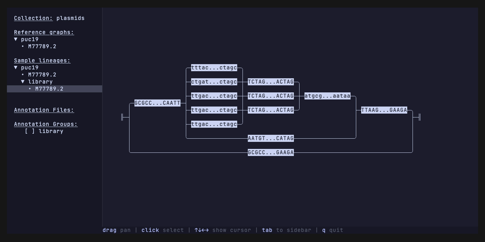

# Combinatorial plasmid design

In this example we will design a library of expression plasmids for _E. coli_. We are looking for the combination of
promoter and ribosome binding site that result in the highest expression of an insulin precursor peptide.

We start by setting up a new gen repository and a default database and collection name. This way we don't have to keep
specifying which database file and collection to use in the `gen import` and `gen update` commands.

```sh
gen init
gen defaults --database insulin.db --collection plasmids
```

```
Gen repository initialized.
Default database set to insulin.db
Default collection set to plasmids
```

Next, we import our base vector from a fasta file as a reference sample called `puc19`.

```sh
gen import fasta puc19.fa --reference puc19
```

```
Fasta imported.
```

Importing the sequence creates one block group and one path, both named `M77789.2`, the accession ID for the pUC19
plasmid that was extracted from the fasta header. Next, we will prepare a _gen update_ operation to insert the insulin
operon variants into the vector, more specifically between position 106 and 539. We need two files to specify the
design: a _parts_ file that contains the sequences of all of the genetic parts that go into the design, and a _library_
file that describes how the parts should be arranged.

The library file is a simple CSV table without headers, where each column represents a 'slot' in the construct, and the
rows represent the possible parts to include in each slot. Gen will create a combinatorial design where all options for
each slot are combined with all options for the other slots. In the example below we have 3 slots, with respectively 5,
2, and 1 part options, this results in 10 possible outcomes (5x2x1).

<table align="center">
<th colspan="3" style="text-align:center">design.csv</th>
<tr>
<td>BBa_J23100</td>
<td>BBa_B0030</td>
<td>proinsulin</td>
</tr>
<tr>
<td>BBa_J23101</td>
<td>BBa_B0032</td>
<td> </td>
</tr>
<tr>
<td>BBa_J23102</td>
<td>BBa_B0034</td>
<td> </td>
</tr>
<tr>
<td>BBa_J23103</td>
<td> </td>
<td> </td>
</tr>
<tr>
<td>BBa_J23104</td>
<td> </td>
<td> </td>
</tr>
</table>

If you create this file by hand outside of a spreadsheet program, please ensure that empty cells are still be separated
by commas. We can then run the update operation using the following command. It reads the region to replace from the
`M77789.2` path of the `puc19` reference and writes the combinatorial result to a new sample called `library`, leaving
the original vector untouched.

```sh
gen update library \
  --sample puc19 \
  --new-sample library \
  --region-name M77789.2:106-539 \
  --library design.csv \
  --parts parts.fa
```

```
Updated with library file: design.csv
```

This adds all of the part combinations as new edges in the `library` sample's block group. Rather than querying the
database to see how the graph is wired, we can look at it directly with the viewer.

## Visualizing the library

The `gen view` command renders a block group as an interactive graph right in the terminal. Pass the graph name and the
sample you want to inspect:

```sh
gen view M77789.2 --sample library
```

Add `--full` to open the full-screen explorer, which adds a sidebar for browsing collections, reference graphs, sample
lineages, and annotation groups:

```sh
gen view M77789.2 --sample library --full
```



The graph makes the design self-evident. The five promoters fan out into the three ribosome binding sites, which all
feed into the single `proinsulin` payload before rejoining the vector backbone. The empty slot in the third column
shows up as the bypass edge along the bottom that skips the payload entirely, and the original pUC19 sequence is still
present as the path straight across the graph. You can drag to pan, click a node to select it, and press `q` to quit.

## Searching the library

To confirm that a particular part made it into the library, or to locate any exact subsequence across the graph, use
`gen search`. It walks every block group and reports each place the query occurs, following valid edges as needed. Here
we look for the `BBa_J23100` promoter:

```sh
gen search TTGACGGCTAGCTCAGTCCTAGGTACAGTGCTAGC --sample library
```

```
sample	graph	blocks	offset
library	M77789.2	[0d80ffde7502:0-35]	0
```

And here we confirm the proinsulin payload is present:

```sh
gen search ATGCGCTTCGTCAATCAGCACCTTTGTGGTTCTCACCTCGTTG --sample library
```

```
sample	graph	blocks	offset
library	M77789.2	[fa260db839e8:0-264]	0
```

The `blocks` column is formatted as `[hash:start-end, ...]`, where `hash` is a 12-character prefix of the node the
block was carved from and `start`/`end` are the coordinates within it. When a match spans several nodes the column
lists each block in order. The `offset` column gives the position within the first block where the match begins.

## Analysing sequencing data

For read mapping we export the block group to a GFA file that graph-aware tools can consume. The `gen export` command
takes a sample name so you can pick which block group to export.

```sh
gen export gfa library.gfa --sample library
```

We will use [minigraph](https://github.com/lh3/minigraph), a lightweight sequence-to-graph mapper, to align long reads
against the exported graph. In the GFA export nodes are identified by two numbers separated by a period: the first is
the source node identifier and the second is the coordinate where the block starts. Because we inserted the library
between coordinate 106 and 539 on the reference path, node 3 is split into 3.0, 3.106 and 3.539.

> **Note:** the `library.gfa` and `sample*.gaf` files checked in alongside this example, and the outputs shown below,
> were produced with an older version of gen that used short integer node identifiers such as `3.0` and `3.539`.
> Current versions of gen instead name each node by its source node hash, so you will see long hash-based identifiers
> like `fc6b26a992cc….106.539` in your own export and mappings rather than the short numbers used here.

### Isolate

We first map long-read NGS reads obtained from a single colony isolate:

```sh
minigraph -cx lr library.gfa sample1.fq -o sample1.gaf
```

```
[M::main::0.000*8.39] loaded the graph from "library.gfa"
[M::mg_index::0.002*3.58] indexed the graph
[M::mg_opt_update::0.002*3.37] occ_max1=50; lc_max_occ=2
[M::worker_pipeline::0.004*2.59] mapped 10 sequences
[M::main] Version: 0.21-r606
[M::main] CMD: minigraph -cx lr -o sample1.gaf library.gfa sample1.fq
[M::main] Real time: 0.005 sec; CPU: 0.012 sec; Peak RSS: 0.002 GB
```

The resulting GAF file has the path to which a read maps listed in the 6th column. We can extract all unique paths that
were identified as follows:

```sh
cut -f6 sample1.gaf | sort | uniq
```

```
<3.539
<3.539<4.0
>3.0>8.0>10.0>4.0>3.539
>3.539
>4.0>3.539
```

Not all reads cover the graph from end to end, but by looking at the longest path `>3.0>8.0>10.0>4.0>3.539` we are able
to identify the genotype of a colony.

### Pool

Pooled DNA assembly is a great cost-effective way to access a lot of sequence diversity. Instead of making each
combination of parts in a separate sample during cloning, we add all possible parts to a single tube in a one-pot
cloning reaction. Analysing the population of sequences obtained from such a reaction is where long-read NGS and graph
sequence representations really shine.

```sh
minigraph -cx lr library.gfa sample2.fq -o sample2.gaf
cut -f6 sample2.gaf | sort | uniq
```

```
<3.539
<3.539<3.106
<3.539<3.106<3.0
<3.539<4.0
<3.539<4.0<10.0<6.0<3.0
<3.539<4.0<10.0<7.0<3.0
<3.539<4.0<10.0<8.0<3.0
<3.539<4.0<11.0<5.0<3.0
<3.539<4.0<11.0<6.0<3.0
<3.539<4.0<11.0<7.0<3.0
[...]
```

As you can see in the output above, there are a lot more unique paths present in this sample. One path in particular you
may be interested in is `>3.0>3.106>3.539` or its reverse complement `<3.539<3.106<3.0`, which represent the empty
vector you started out with. For many cloning operations there will always be some carryover of the empty vector. In
conventional cloning this would be eliminated when you create an isolate by picking a single colony, but in pooled
sample you can't do that. This usually isn't a problem, as long as the frequency of empty vector is relative low. We can
measure this by counting the relative occurence of the empty vector paths amongst all observe paths that traverse node
3.0 and 3.539.

```sh
total_count=$(cut -f6 sample2.gaf | grep '3\.0' | grep '3\.539' | wc -l)
cut -f6 sample2.gaf | grep '3\.0' | grep '3\.539' | sort | uniq -c | awk -v total="$total_count" '{printf "%.2f %s\n", $1 / total * 100, $2}'
```

```
27.87 <3.539<3.106<3.0
1.64 <3.539<4.0<10.0<6.0<3.0
1.64 <3.539<4.0<10.0<7.0<3.0
4.92 <3.539<4.0<10.0<8.0<3.0
1.64 <3.539<4.0<11.0<5.0<3.0
1.64 <3.539<4.0<11.0<6.0<3.0
3.28 <3.539<4.0<11.0<7.0<3.0
3.28 <3.539<4.0<11.0<8.0<3.0
1.64 <3.539<4.0<11.0<9.0<3.0
[...]
```

Here we see that approximately 28% of all molecules in the sample are carryover, which isn't great. In a real sample
from a Golden Gate cloning reaction for example this will generally be much lower. Note that we haven't taken into
account any biases to length in this quick analysis.

# Appendix

## Simulating NGS reads using VG

The NGS data used in this example was simulated using the VG toolkit. For the isolate sample we started from a single
sequence and converted that into a graph first:

```sh
vg construct -r sample1.fa | vg convert --xg-out - > isolate.xg
vg sim -x isolate.xg -n 10 -l 2000 -a | vg view --fastq-out - > sample1.fq
```

For the pooled sample we use a GFA file exported by gen. VG doesn't handle lowercase nucleotides, so we convert
everything to uppercase first.

```sh
cat library.gfa | tr 'a-z' 'A-Z' > library_allcaps.gfa
vg convert --gfa-in library_allcaps.gfa --xg-out > library.xg
vg sim -x library.xg -n 1000 -l 2000 -a | vg view --fastq-out - > sample2.fq
```
